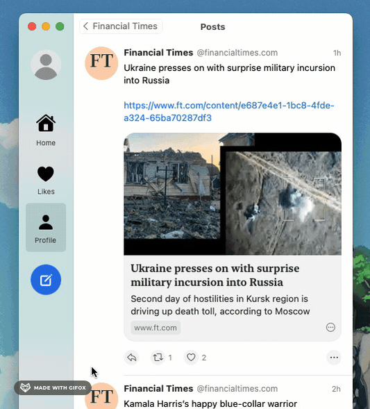

# Refreshable Scroll View

A pull/scroll to refresh implementation for AppKit modeled on UIKit’s `UIRefreshControl`.



There are two parts to Refreshable Scroll View:

- `RefreshableScrollView` - a subclass of `NSScrollView` that has an optional (strongly referenced) `refreshControl` property
- `RefreshControl` - the control that manages refresh progress and notifies your app of refresh activation

`RefreshControl` does not have any UI of its own, unlike `UIRefreshControl`. Instead it’s designed to be subclassed to
provide the ability to create your own refresh UI—flexibility that `UIRefreshControl` lacks. However, if you’re happy
with the indeterminate progress indicator UI of `UIRefreshControl` then this package includes `ProgressIndicatorRefreshControl`
as a drop-in equivalent.

## Installation

Refreshable Scroll View is installable using Swift Package Manager.

Add to your `package.swift`

```
.package(url: "https://github.com/mikeyclarke/RefreshableScrollView.git", from: "1.0.0"),
```

Or through the Xcode UI:

- “Add Package Dependency…” (currently available from the File menu or in the right-click menu in the File Navigator)
- Enter the URL of this repository: `https://github.com/mikeyclarke/RefreshableScrollView.git`
- Choose "Up To Next Major Version": 1.0.0

## Usage

First you’ll want to use (or subclass if you wish) `RefreshableScrollView` instead of `NSScrollView`. Then you’ll want
to assign a control to its `refreshControl` property.

Since `RefreshControl` is an `NSControl` you can use the target-action pattern to be notified of invokation.

If you’re happy with the default UI then you can use `ProgressIndicatorRefreshControl` as in the example below,
otherwise swap it out for your own `RefreshControl` subclass.

```swift
import RefreshableScrollView

class MyViewController: NSViewController {
    override func loadView() {
        let scrollView = RefreshableScrollView()
        scrollView.documentView = // …

        let refreshControl = ProgressIndicatorRefreshControl(
            target: self,
            action: #selector(refreshControlInvoked(_:))
        )
        scrollView.refreshControl = refreshControl

        self.view = scrollView
    }

    private func refreshData() async {
        // …
    }

    @objc private func refreshControlInvoked(_ sender: ProgressIndicatorRefreshControl) {
        Task {
            await self.refreshData()
            await MainActor.run {
                if let scrollView = self.view as? RefreshableScrollView {
                    scrollView.refreshControl?.endRefreshing()
                }
            }
        }
    }
}
```

`RefreshControl` supports the same API as [`UIRefreshControl`](https://developer.apple.com/documentation/uikit/uirefreshcontrol#1653347):

- `beginRefreshing()` tells the control that a refresh operation was started programmatically
- `endRefreshing()` tells the control that a refresh operation has ended
- `isRefreshing` is a boolean value indicating whether a refresh operation has been triggered and is in progress

### Building a custom refresh control

If you’re not satisfied with the default progress indicator-based UI then you can instead create your own. To do this
you’ll need to subclass `RefreshControl`. It is recommended that you take a look at the implementation of
[`ProgressIndicatorRefreshControl`](Sources/RefreshableScrollView/ProgressIndicatorRefreshControl.swift) to use as a
reference.

There are two methods your subclass can override:

- `stateDidChange(from:to:)` - this method is called after the state has changed and should be used to update your UI
accordingly
- `willDeactivate() async` - this method is called at the start of the deactivation process. It is asynchronous to give
you the ability to perform animations (using the async variant of [`runAnimationGroup(_:completionHandler:)`](https://developer.apple.com/documentation/appkit/nsanimationcontext/1529847-runanimationgroup))
before the refresh control is hidden again. You could instead perform your animation in your consuming code before
calling `endRefreshing()` but this method enables you to confine all of your UI code to your control class. At
the conclusion of this method `stateDidChange(from:to:)` will be called.

Whilst you’ll almost certainly need to override `stateDidChange(from:to:)`, you’ll only need to use `willDeactivate` if
you need to show an animation before the control disappears, otherwise you can ignore it. The default implementations
of both methods are empty so you do not need to call `super`.

`stateDidChange(from:to:)` is called with the previous and current `RefreshControl.State`, which can also be read at any
time through the `state` property of a control. There are four different states.

#### States

- Idle - the refresh control is not visible at all.
- Triggering - the refresh control is visible and the scroll view is being scrolled up or down. This state has an
associated value named `progress`. When progress reaches `0` the control becomes idle, when it reaches `1` it activates.
- Activated - a refresh is in progress. Once this state is reached or activated programmatically it remains until
`endRefreshing()` is called.
- Deactivating - refresh has completed (your app called `endRefreshing()`) and the control is cleaning up before
returning to the idle state. As noted above, the control’s async `willDeactivate()` method will be called at this point
and the control will not return to idle until that method has concluded, giving you the opportunity to perform clean-up
animations.

#### Design considerations

Scrolling is monitored by observing `NSView.boundsDidChangeNotification` notifications. These notifications are throttled
by AppKit and so you should not assume that the triggering progress will increment or decrement smoothly. In fact, it is
possible if the user scrolls fast enough for the state to jump straight from `idle` to `activated`.

To ensure that refresh is only invoked deliberately and not by a user scrolling really fast, the refresh control will
only allow refreshing if the scroll event began with the scroll position close to the top. It will also disallow
multiple activations within a second of one another so as to prevent activation triggering a second time if the refresh
concluded quickly enough. The boolean `canRefresh` property can be used to check whether the state can reach activation
during a scroll event. The `ProgressIndicatorRefreshControl` for example clamps the visibility of the indicator at 50%
if `canRefresh` is false to communicate that pull to refresh exists but that a new scroll is required to activate it.

## Requirements

- macOS 13+
- Swift 5

## License

RefreshableScrollView is available under the MIT license. See [LICENSE](LICENSE) for details.
